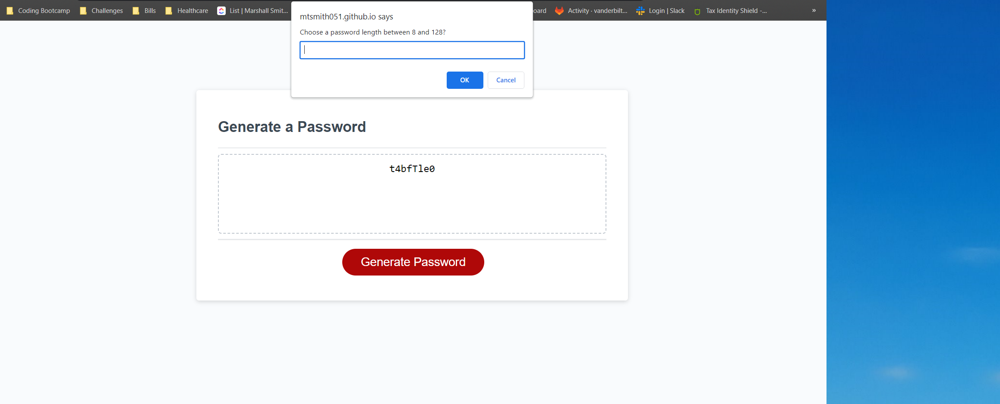
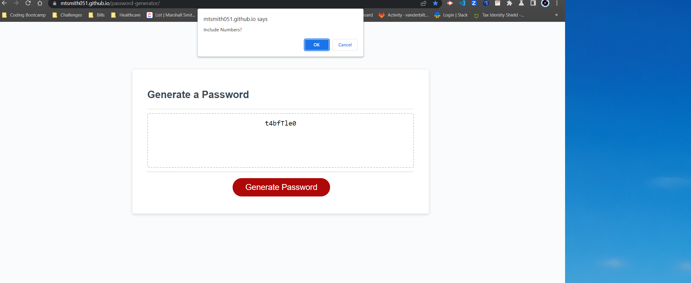
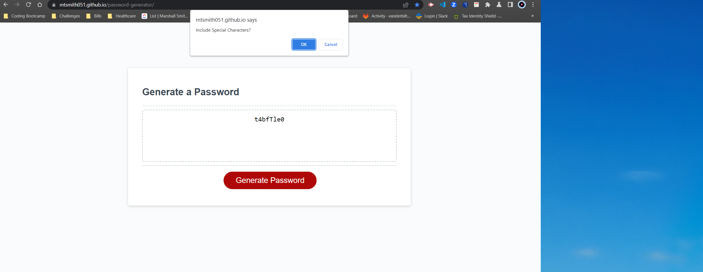
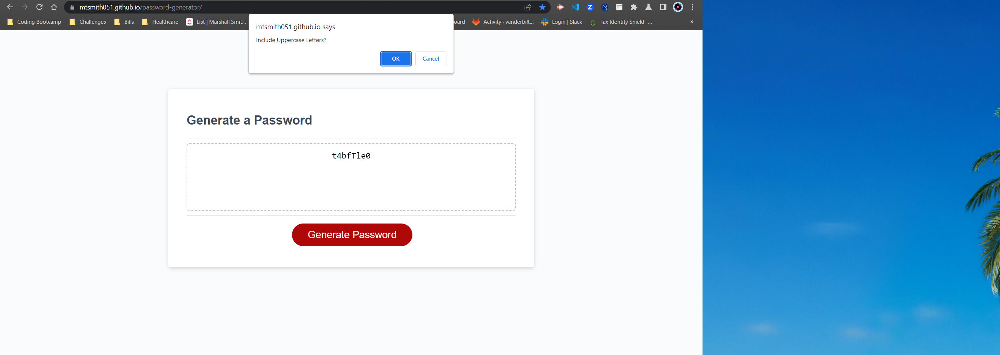
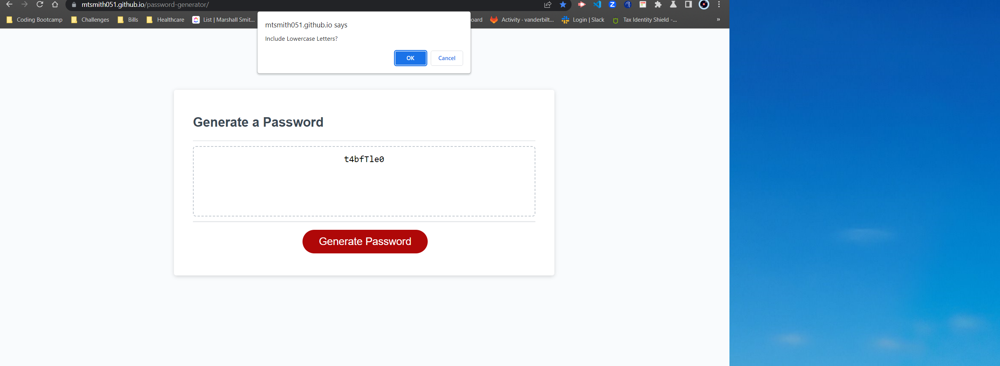
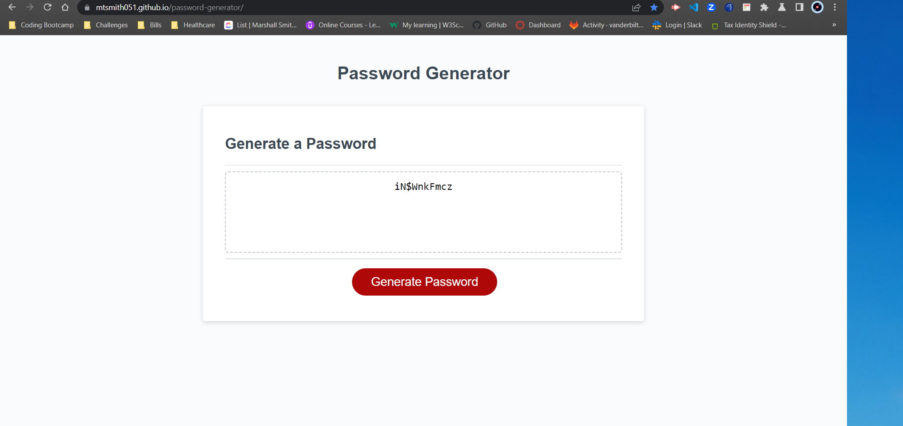

# Password Generator

## Description
This project is a password-generator that will provide a randomly produced set of characters based on parameters that the user provides. I.e. Length (8-128 chars), Uppercase Letters, Lowercase Letters, Special Characters, and Numbers.

## Table of Contents
* Usage
* Links
* Features

## Usage

## Links

GitHub: https://github.com/mtsmith051/password-generator
Deployed Website: https://mtsmith051.github.io/password-generator/

## Features

* This program utilizes user input for different criteria to create a randomly generated and secured password. 
* Users will input criteria using popup windows. 
